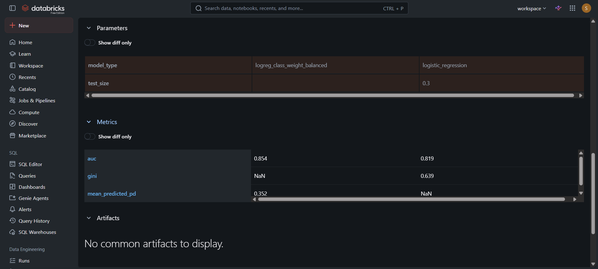
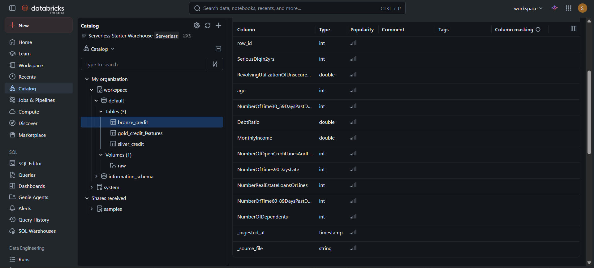

# Credit-Risk Data Pipeline on Databricks

Medallion-architecture pipeline (bronze → silver → gold) on public credit data,
with MLflow experiment tracking and a champion/challenger model comparison.
Third project in a series: the modelling decisions come from my
[ifrs9-ecl-calculator](https://github.com/sanjanaSomashekar24/ifrs9-ecl-calculator)
(decision log D1–D7) and the monitoring perspective from my
[credit-scorecard-monitoring](https://github.com/sanjanaSomashekar24/credit-scorecard-monitoring)
dashboard.

## Architecture

raw CSV (Unity Catalog volume)
→ **BRONZE** `bronze_credit` — schema-enforced ingest, data landed as-is +
provenance columns (`_ingested_at`, `_source_file`); a data-quality report
*detects* issues without fixing them (29,731 missing incomes, 1 impossible age,
241 absurd utilization ratios, 269 rows with 96/98 special codes)
→ **SILVER** `silver_credit` — the documented cleaning decisions (capping,
imputation + missing-flag, special-code collapse) applied in PySpark, certified
by post-conditions (149,999 rows, 0 nulls, max past-due 20, max utilization 10)
→ **GOLD** `gold_credit_features` — model-ready feature table, lineage columns
dropped
→ **MLflow** — experiment tracking + logged models
→ 

Detection (bronze) and correction (silver) are separate, auditable layers —
each layer adds its own metadata columns, leaving a lineage trail.

## Results

| Run | AUC | Gini | Mean predicted PD (true: 6.7%) |
|---|---|---|---|
| logreg_baseline (champion) | 0.8193 | 0.6386 | calibrated (~6.7%) |
| logreg_balanced_challenger | 0.8544 | 0.7088 | **35.2% — uncalibrated** |

**Champion/challenger finding:** class-weight rebalancing *improved* ranking
(regularisation under imbalance suppresses minority-class signal; rebalancing
recovers it) but destroyed calibration — the challenger predicts a 35% portfolio
default rate against a true 6.7%. For a PD scorecard feeding provisioning,
calibration is non-negotiable, so the calibrated baseline remains champion; the
production-grade option would be the challenger plus explicit recalibration
(Platt/isotonic).

**Reproducibility:** the baseline AUC (0.8193) and the income median (5400.0,
via distributed approxQuantile) exactly match the pandas implementation in the
companion projects — same data, same decisions, same numbers, three platforms.

## Delta details worth noting

Every table write is versioned (`DESCRIBE HISTORY`, `VERSION AS OF`) — the
audit-trail property that makes Delta suitable for regulated data.

## Notebooks

- `01_bronze_ingest` — schema-enforced read, Delta write, DQ report, time travel
- `02_silver_clean` — cleaning decisions in PySpark + post-condition checks
- `03_gold_and_mlflow` — gold features, MLflow runs, champion/challenger

Built on Databricks Free Edition (serverless). Dataset: "Give Me Some Credit"
(Kaggle, 2011) — chosen for continuity with the companion projects; the
architecture is the point and scales unchanged.